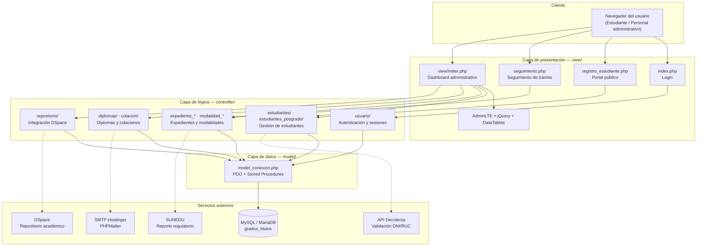

# UltimoGrados — Sistema de Gestión de Grados y Títulos

Sistema web institucional desarrollado para la **Universidad Tecnológica Empresarial de Arequipa (UTEA)**, orientado a gestionar de forma integral el ciclo de vida de los grados y títulos académicos, desde el registro del expediente hasta la emisión del diploma y el reporte regulatorio ante la SUNEDU.

---

## Descripción general

Sistema web que digitaliza y centraliza los procesos administrativos del área de Grados y Títulos de una universidad peruana. La plataforma gestiona el ciclo completo del trámite académico, tanto para pregrado como para posgrado: desde el registro del expediente y la validación documental hasta la generación del diploma, la programación de ceremonias de colación y la exportación de datos al formato oficial exigido por la SUNEDU.

Incluye un portal público donde los estudiantes pueden registrar sus datos personales, adjuntar fotografía y completar la declaración de autoidentificación étnica conforme a la normativa vigente del MINEDU, garantizando el cumplimiento de los estándares de equidad e inclusión establecidos por el Estado peruano.

---

## Impacto en la gestión

> *Valores estimados a partir de la comparación entre el flujo manual (físico/Excel) previo y el flujo digitalizado por el sistema. Sirven como referencia ilustrativa del impacto típico de este tipo de digitalización.*

| Indicador | Antes (proceso manual) | Con el sistema | Mejora estimada |
| --- | --- | --- | --- |
| Tiempo de registro de un expediente | ~25-30 min (formularios físicos) | ~5-7 min (formulario digital validado) | **↓ ~75%** |
| Tiempo de generación de un diploma | ~1-2 días (elaboración y revisión manual) | Minutos (plantilla PDF automatizada) | **↓ ~90%** |
| Errores de digitación en datos del estudiante | Frecuentes (doble tipeo, sin validación) | Mínimos (validación de DNI/RUC vía API) | **↓ ~80%** |
| Tiempo de elaboración de reportes SUNEDU | Días (consolidación manual en Excel) | Minutos (exportación automática) | **↓ ~95%** |
| Trazabilidad del trámite | Nula o por consulta telefónica/presencial | Seguimiento en línea en tiempo real | **100% de expedientes con seguimiento digital** |
| Tiempo de respuesta al estudiante (consulta de estado) | Días (visita presencial a la oficina) | Inmediato (portal público de seguimiento) | **↓ ~95%** |

---

## Funcionalidades principales

### Gestión de estudiantes

- Registro de datos personales de pregrado y posgrado
- Validación automática de DNI/RUC mediante la API de Decolecta (APIperu)
- Captura de autoidentificación étnica e información de lengua indígena (cumplimiento normativo)
- Subida de fotografía de pasaporte y documentos escaneados
- Portal de seguimiento público para que el estudiante consulte el estado de su trámite

### Expedientes y modalidades

- Registro de expedientes por modalidad de titulación (tesis, examen profesional, suficiencia, etc.)
- Gestión diferenciada para pregrado y posgrado
- Control de estados del trámite con auditoría de fechas

### Diplomas y certificados

- Generación de diplomas en PDF mediante **mPDF** con plantillas institucionales
- Firma digital de documentos
- Buzón Digital para carga masiva de diplomas escaneados
- Integración con el repositorio **DSpace** para archivo académico oficial

### Registro general y colaciones

- Listados generales (alfabético, por facultad, escuela, sede y modalidad)
- Registro y gestión de ceremonias de colación
- Notificaciones por correo electrónico a los graduandos (PHPMailer + SMTP Hostinger)

### Reportes y cumplimiento regulatorio

- Exportación de datos en formato SUNEDU para grados de pregrado y posgrado
- Reportes filtrables por fecha, facultad, escuela, sede y modalidad
- Estadísticas consolidadas para autoridades

### Administración del sistema

- Control de acceso por roles: Administrador, Secretaria, Repositorio y Súper Administrador
- Gestión de usuarios, autoridades y empleados
- Configuración de sedes, facultades y escuelas profesionales

---

## Stack tecnológico

| Capa | Tecnología |
| --- | --- |
| Backend | PHP (PDO + MySQL procedural/OOP) |
| Base de datos | MySQL / MariaDB |
| Frontend | HTML5, CSS3, JavaScript (jQuery) |
| UI Framework | AdminLTE 3 |
| Tablas interactivas | DataTables, Select2 |
| Generación de PDF | mPDF 6 |
| Correo electrónico | PHPMailer (SMTP) |
| Validación DNI/RUC | API Decolecta (APIperu) |
| Repositorio académico | DSpace (integración REST) |
| Servidor local | XAMPP (Apache + MySQL) |
| Gestión de paquetes PHP | Composer |
| Gestión de paquetes JS | npm |

---

## Arquitectura del proyecto

El proyecto sigue un patrón **MVC liviano** implementado en PHP puro, con integraciones a servicios externos para validación de identidad, repositorio académico, notificaciones y reportes regulatorios.



### Estructura de carpetas

```text
ultimogrados/
│
├── index.php                   # Punto de entrada / login
├── registro_estudiante.php     # Portal público de registro estudiantil
├── seguimiento.php             # Seguimiento de trámite (pregrado)
├── seguimiento_posgrado.php    # Seguimiento de trámite (posgrado)
│
├── config/                     # Configuración SMTP y conexión
├── controller/                 # Controladores (lógica de negocio y endpoints AJAX)
│   ├── usuario/                # Autenticación y sesiones
│   ├── estudiantes/            # CRUD estudiantes pregrado
│   ├── estudiantes_posgrado/   # CRUD estudiantes posgrado
│   ├── diplomas/               # Generación y gestión de diplomas
│   ├── colacion/               # Ceremonias de colación
│   ├── expediente_*/           # Expedientes académicos
│   ├── modalidad_*/            # Modalidades de titulación
│   └── repositorio/            # Integración DSpace
│
├── model/                      # Capa de datos (PDO, consultas SQL, stored procedures)
├── view/                       # Vistas HTML/PHP
│   ├── index.php               # Shell principal del dashboard
│   ├── estudiantes/            # Listados y formularios de estudiantes
│   ├── diplomas/               # Formularios de diploma
│   ├── colacion/               # Gestión de colaciones
│   ├── reportes/               # Exportaciones SUNEDU
│   └── MPDF/                   # Motor de generación de PDF
│
├── js/                         # Scripts AJAX y lógica frontend (50+ archivos)
├── database/                   # Migraciones SQL incrementales
├── uploads/                    # Archivos subidos por usuarios
└── plantilla/                  # Assets de AdminLTE (CSS, JS, plugins)
```

---

## Instalación local

### Requisitos previos

- XAMPP (Apache + MySQL/MariaDB) con PHP 7.4+
- Composer
- Node.js y npm (opcional, para el servidor de desarrollo)

### Pasos

```bash
# 1. Clonar el repositorio dentro de htdocs
git clone <repo-url> c:/xampp/htdocs/ultimogrados

# 2. Instalar dependencias PHP (generación de PDF)
cd ultimogrados/view
composer install

# 3. Importar la base de datos en phpMyAdmin o por consola
# (solicitar el dump .sql al administrador del proyecto — no incluido en el repo)

# 4. Configurar la conexión a la base de datos
# Copiar model/model_conexion_ejemplo.php a model/model_conexion.php
# y completar host, puerto, usuario y contraseña de MySQL

# 5. Configurar el correo electrónico
# Editar config/config.php con las credenciales SMTP

# 6. Levantar Apache y MySQL desde el panel de XAMPP
# Acceder en: http://localhost/ultimogrados
```

---

## Variables de entorno / configuración sensible

Los siguientes archivos contienen credenciales y **no se incluyen en el repositorio**:

- `config/config.php` — Credenciales SMTP (usuario, contraseña, host)
- `model/model_conexion.php` — Credenciales de base de datos

Se incluye `model/model_conexion_ejemplo.php` como plantilla de referencia sin datos sensibles.

---

## Autor

**Jersson Corilla**
Desarrollador Full Stack — Perú

---

## Licencia

© Jersson Corilla. Todos los derechos reservados.
